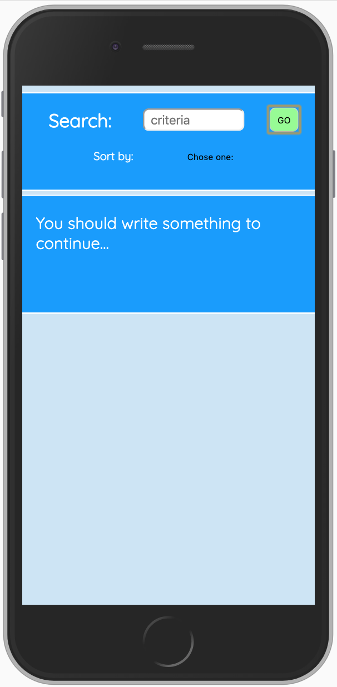
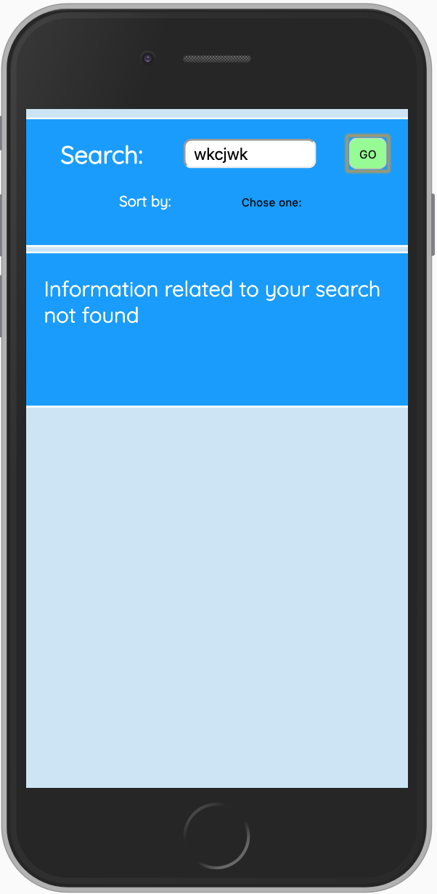

# Adevinta front-end-test 

## Deploy link: 

## Project Main Goals 

- Create a search var where introduce a text to look for movies/series.
- The movies/series should come from an external API (https://www.omdbapi.com/)
- Results should be listed in a grid and each result should be an item with a photo, title, description, year and rating. 
- Items should be links (https://www.imdb.com/title​/${imdbID})
- The showed results could be sort by at least one field. 

## Functional Description

On this application users will be able to search series & movies and see them listed with many information about them.

Also they will be able to see more information and media if they press in any of the results because they will be redirected to another webpage.

Using the select var available, users could also sort the results obtained by the published year and the rating of the movies/series (always from higher number to lower).

Users will also see different feedback messages if the information what are they looking for is not available or if they forgot to write something in the search var.

## Use cases

User can search, sortby.

## Screenshoots

#### Initial Screen

User can search movies/series from the API (https://www.omdbapi.com/).

#### Results Screen

If the searched information does exist: user will see the results on the screen.

 

#### Sortby Screen

When there are some results, user can sort by published year or rating.

#### Input empty Screen

When user does not write anything on the search var and submit, it will see this feedback error during 3 seconds.

####  Information not found Screen

When the information searched by the user does not find any result on the API, it will see this feedback error during 3 seconds.

#### Desktop view Screen

This is how it looks like in desktop mode. 

